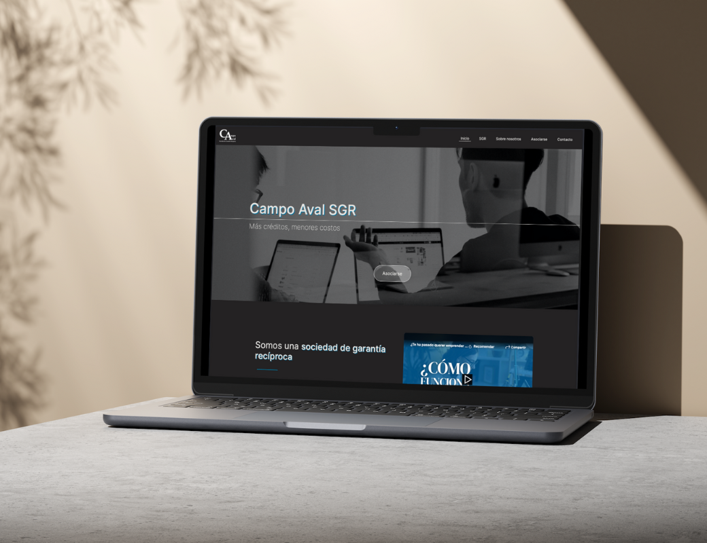

# Proyecto final: sitio web para Campo Aval S.G.R.

¡Bienvenido al repositorio de mi proyecto final de desarrollo web! Este proyecto representa un sitio web construido con una combinación de HTML5, CSS3, Sass y Bootstrap para lograr una experiencia de usuario atractiva.

Para este proyecto, comencé haciendo un mockup en Figma (https://www.figma.com/file/Bnz2MJOY4MTOr9jSDy3HHG/Pre-entrega-1-Lucia-Cosenza?type=design&node-id=104%3A516&mode=design&t=FiZCSjJfNxavZFOP-1)

Y con mucho esfuerzo a lo largo de los dos meses que duró este curso, fui aplicando los conocimientos para lograr llevar a cabo mi mockup.

## Características Destacadas

- **HTML5 y CSS3:** La estructura del sitio sigue las mejores prácticas de HTML5, mientras que el diseño y estilo están implementados con CSS3 para asegurar un aspecto moderno y compatible.
- **Flexbox y Grids:** La disposición de los elementos se ha logrado mediante el uso de Flexbox y Grids, lo que garantiza un diseño flexible y receptivo, adaptándose a diferentes tamaños de pantalla.
- **Animaciones:** Se han incorporado animaciones sutiles para mejorar la experiencia del usuario y hacer que la navegación sea más atractiva.
- **Sass:** El preprocesador Sass se ha utilizado para organizar y mantener el código CSS de manera eficiente, facilitando la escalabilidad del proyecto.
- **Bootstrap:** Componentes de Bootstrap han sido integrados para agilizar el desarrollo y garantizar una interfaz coherente en diversos navegadores.
### Acceso al sitio
https://campo-aval.vercel.app
